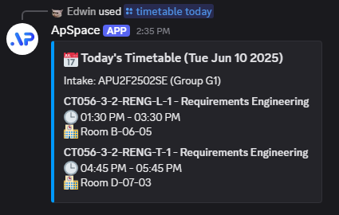
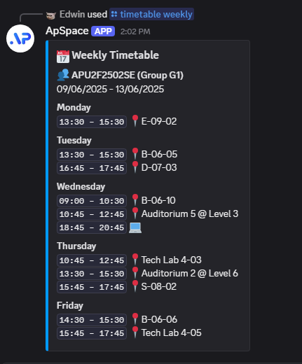
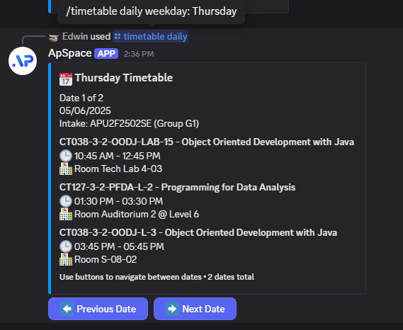
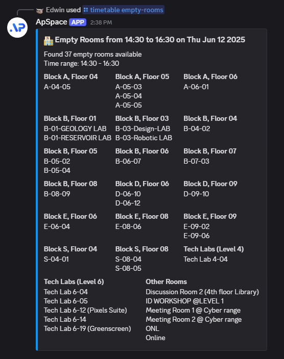
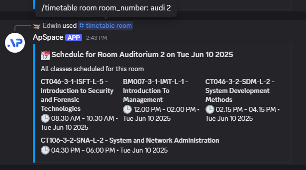

# ApSpace Discord Bot


Stay up to date with your APU auto-scheduled timetable right in your Discord server! This bot helps you track your class schedule, find empty rooms, and automatically shares updates with your family or friends.

## 📚 Table of Contents
- [Features](#%EF%B8%8F-features)
- [Why This Bot?](#-why-create-this-bot)
- [Tech Stack](#-tech-stack)
- [Setup Instructions](#-setup-instructions)
- [Usage Guide](#-usage-guide)
- [Support](#-support)
- [Recent Updates](#recent-updates)

## ⚙️ Features

- **🔄 Personal Timetable Management**
  - Remember your intake code and tutorial group for quick access
  - View timetable by date, weekday, or intake code
  - Multiple display formats for weekly schedule (time-only, with location, with module details)
  - 12-hour or 24-hour time format options
  - Smart pagination for multi-week schedules
  - Automatic weekly and daily timetable updates
  - Smart filtering based on tutorial groups
  - Personalized DM notifications for your schedule
  - Clear distinction between online and physical classes
  - Week-based grouping with easy navigation

- **📬 Smart Notifications**
  - Choose between server-wide announcements and personal DMs
  - Rate-limited notifications to prevent Discord API throttling
  - Daily updates at 6:00 AM (Monday-Friday)
  - Weekly schedule overview on Sunday at 8:00 PM
  - Intelligent buffering between messages for reliability

- **🤖 Bot Features**
  - Slash command support for easy interaction
  - Smart error handling and user feedback
  - Efficient rate limiting for reliable operation
  - Embedded message formatting for better readability

## 🤔 Why Create This Bot?

The main reason why I wanted to automate this is because my parent will always chase me for weekly timetable updates... 

I will always hear questions like ***"Is the timetable still the same as last week?"***, ***"What time is your class starting for tomorrow?"***, although clearly I have already written the schedule in a WhatsApp group, I will still be chased for latest updates... 

They complained that **screenshots are too difficult to read**, so the only way to keep them updated is by **manually typing out the timetables weekly**. I have been doing this **manually** for the **past 2 years of my Diploma studies**. 

But I thought, why do it manually if I can make an automation to do it for me? I'm a Software Engineering student myself, I built bots for my clients as freelance... 

So why not build something that could ***make my life easier once and for all?*** And this is where **ApSpace Discord Bot** comes into place. Your family members surely do not have access to an ApSpace account, but what they do have is your contact such as WhatsApp and Discord. 

## 🧑‍💻 Tech Stack

- **Runtime**
  - Node.js ≥ v20.x

- **Core Libraries**
  - Discord.js - Discord bot framework with slash commands support
  - Prisma ORM - Database management with migrations
  - PostgreSQL - Database system
  - Axios - API communication with caching support

- **Architecture**
  - Modular command structure
  - Shared utility functions
  - Efficient data caching
  - Smart rate limiting
  - Automatic error handling

- **Development Tools**
  - dotenv - Environment configuration
  - ESLint - Code quality
  - Jest - Testing

## 🚀 Setup Instructions

1. **Prerequisites**
   ```bash
   Node.js ≥ v20.x
   PostgreSQL Client
   ```

2. **Installation**
   ```bash
   # Clone the repository
   git clone https://github.com/notedwin-dev/ApSpace-Discord-Bot.git
   cd ApSpace-Discord-Bot

   # Install dependencies
   npm install

   # Set up environment variables
   cp .env.example .env
   # Edit .env with your Discord token and database details
   ```

3. **Database Setup**
   ```bash
   # Run database migrations
   npx prisma migrate dev
   ```

4. **Starting the Bot**
   ```bash
   # Start the bot
   npm start
   ```

## 📖 Usage Guide

### Basic Commands

- `/setintake <intake_code> <tutorial_group> <dm_notifications>` - Set your intake code, tutorial group, and DM preferences
  - `intake_code`: Set the intake code for future querying.
  - `tutorial_group`: Set the tutorial group for future querying.
  - `dm_notifications`: Set your preference for receiving notifications about daily and weekly timetables

- `/timetable` - View timetable information
  
  
  - `/timetable today [intake_code] [tutorial_group] [sort_by]` - Get today's timetable
    - `intake_code`: Optional overwriting for intake code querying.
    - `tutorial_group`: Optional overwriting for tutorial group querying.
    - `sort_by`: Optional overwriting for sorting filters.
  
  
  - `/timetable weekly <display_format> [time_format] [intake_code] [tutorial_group]` - Get weekly timetable
    - `display_format`: Time Only, Time + Location, Time + Module Code + Location, Time + Module Name + Location
    - `time_format`: 12-hour or 24-hour time format
    - `intake_code`: Optional overwriting for intake code querying.
    - `tutorial_group`: Optional overwriting for tutorial group querying.
  
  
  - `/timetable daily <weekday> [intake_code] [tutorial_group] [sort_by]` - Get timetable for a specific weekday
    - `weekday`: Specify the day of the week (e.g. Monday, Tuesday, Wednesday, Thursday, Friday...)
    - `intake_code`: Optional overwriting for intake code querying.
    - `tutorial_group`: Optional overwriting for tutorial group querying.
    - `sort_by`: Optional overwriting for sorting filters.
      
  
  - `/timetable date <date> [intake_code] [tutorial_group] [sort_by]` - Get timetable for a specific date
    - `date`: Specify a date in YYYY-MM-DD format (e.g. 2025-04-24)
    - `intake_code`: Optional overwriting for intake code querying.
    - `tutorial_group`: Optional overwriting for tutorial group querying.
    - `sort_by`: Optional overwriting for sorting filters.
  
  
  - `/timetable empty-rooms [start_time] [end_time] [date]` - Find empty rooms (Classroom finder)
    - `start_time`: Optionally specify the start time you want to use the empty room. (defaults to current time)
    - `end_time`: Optionally specify the end time when you are ready to let go of the empty room. (defaults to 1 hour after current time)
    - `date`: Optionally specify the date (defaults to current date)

  
  - `/timetable room <room_number> [date]` - Get schedule for a specific room
    - `room_number`: Specify the room number (e.g. S-08-02)
    - `date`: Optionally find the schedule of the specific room by date

- `/schedule` - Configure server-wide timetable settings
  - `/schedule channel <channel>` - Set channel for server announcements
  - `/schedule intake <intake_code>` - Set server-wide default intake
  - `/schedule disable` - Disable server-wide announcements

### FAQ

#### How do I search for specific rooms?
- **Auditoriums**: You can search using any of these formats:
  - `/timetable room Audi 1`
  - `/timetable room Auditorium 1`
  - `/timetable room Auditorium 1 @ Level 6`
  All these will find the same room.

- **Tech Labs**: Similarly flexible search:
  - `/timetable room Tech Lab 4-03`
  - `/timetable room TLab 4-03`

- **Regular Rooms**: Use the standard format:
  - `/timetable room B-06-12`

The search is case-insensitive and smart enough to match rooms even with additional location information.

### Schedule Updates

The bot automatically sends:
- Daily schedule updates (6:00 AM, Monday-Friday)
- Weekly schedule overview (8:00 PM, Sunday)
- Immediate updates for schedule changes

#### Notification Features
- Server-wide announcements in designated channels (Requires ModerateMembers permission)
- Personal DM notifications (opt-in)
- Rate-limited message delivery to prevent Discord throttling
- Clear distinction between online (💻) and physical (📍) classes
- Tutorial group specific filtering
- Smart pagination for multi-week schedules
- Customizable display formats:
  - Time Only
  - Time + Location
  - Time + Module Code + Location
  - Time + Module Name + Location
- Flexible time format (12-hour or 24-hour)

## 💝 Support

If you find this bot helpful, consider supporting the project:

[](https://ko-fi.com/J3J7PPGKH)

## 📄 License

This project is licensed under the MIT License - see the [LICENSE](LICENSE) file for details.

## Recent Updates
### July 27, 2025
- **Feature**: Added autocomplete for the week option using the `fetchAllTimetable` function.
- **Bug Fix**: Ensured group filtering is applied after fetching timetables by intake code.
- **Enhancement**: Improved filtering logic to handle tutorial groups more effectively.
